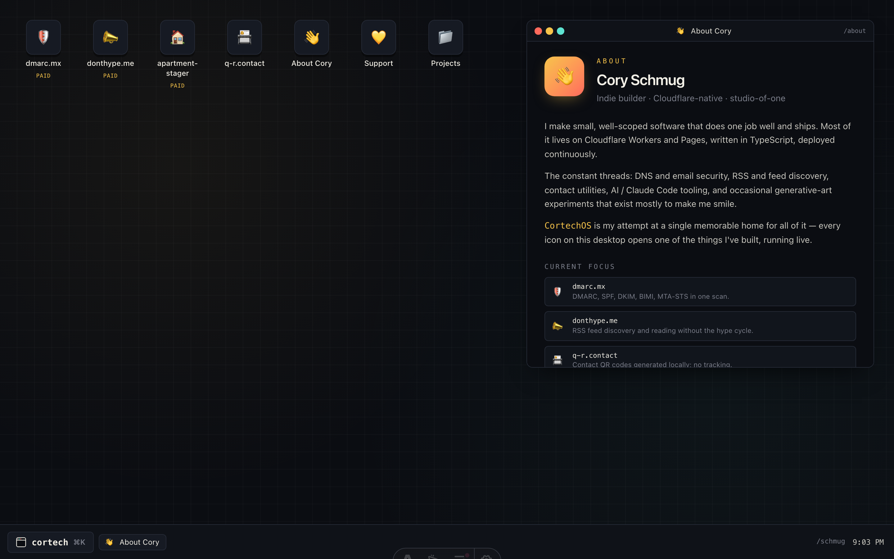

# CortechOS

The portfolio at [cortech.online](https://cortech.online) — an Astro-rendered landing that hydrates into a tiny desktop OS where each window is one of my projects. Mobile viewport falls back to a vertical card grid.



> Animated demo: [`docs/screenshot-desktop.gif`](docs/screenshot-desktop.gif) — boot → ⌘K launcher → open Projects → drag.

## Run locally

Requires Node `>=22.12.0`.

```sh
npm install
npm run dev          # http://localhost:4321
```

## Build & deploy

```sh
npm run build        # → dist/
```

Cloudflare Pages:

| Setting          | Value           |
| ---------------- | --------------- |
| Framework preset | None            |
| Build command    | `npm run build` |
| Output directory | `dist`          |
| Node version     | 22              |

Required build-time env var: **`GITHUB_TOKEN`** — a fine-grained PAT with **public-repo read-only** access (no scopes need to be granted beyond that). The build calls `https://api.github.com/users/schmug/repos` to prerender `/api/projects.json` and the Projects page; without auth, Cloudflare's shared build IPs hit the 60/hr unauthenticated rate limit and the build now fails loudly rather than silently shipping an empty list. Set the var as **encrypted** in Pages → Settings → Environment variables.

`public/_routes.json` ships `{ include: [], exclude: ["/*"] }` so Pages bypasses the Functions runtime entirely — every path is served as a static asset. See [`docs/architecture.md`](docs/architecture.md#deploy-contract) for why.

## Tech stack

- **Astro 6** static site (`output: 'static'`) with one React island
- **React 19** for the interactive shell, `lazy()`-split into `OSShell` (≥768px) and `MobileShell` (<768px)
- **Tailwind v4** via `@tailwindcss/vite`
- **zustand** (with `persist` middleware) for the window-manager store
- **react-rnd** for draggable / resizable windows
- **lucide-react** for icons

## Tests

```sh
npm run lint         # eslint
npm run format:check # prettier — use `npm run format` to auto-fix
npm test             # vitest — unit tests for store + helpers
npm run test:e2e     # playwright — desktop golden path, mobile fallback, iframe embed
npm run typecheck    # astro check && tsc --noEmit
```

The same commands run in GitHub Actions on every PR (see [`.github/workflows/ci.yml`](.github/workflows/ci.yml)).

## Architecture

[`docs/architecture.md`](docs/architecture.md) covers the layering, app registry contract, window-manager store shape, a11y contract, and deploy contract — start there if you want to add an app or change a behavior.

The original product spec — vision, build sequence, open questions — lives at [`docs/superpowers/specs/2026-04-12-cortechos-design.md`](docs/superpowers/specs/2026-04-12-cortechos-design.md).

## License

[MIT](LICENSE) © [Schmug](https://github.com/schmug)
